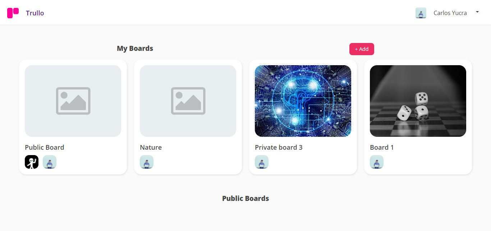
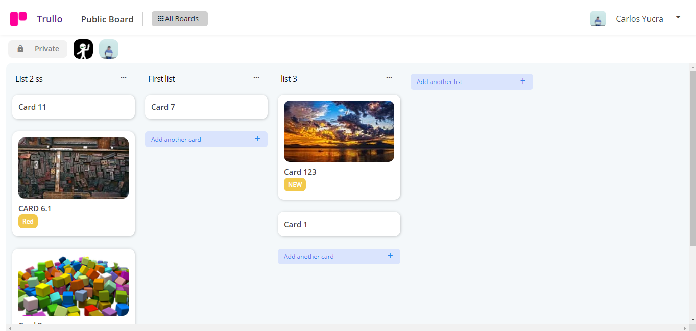
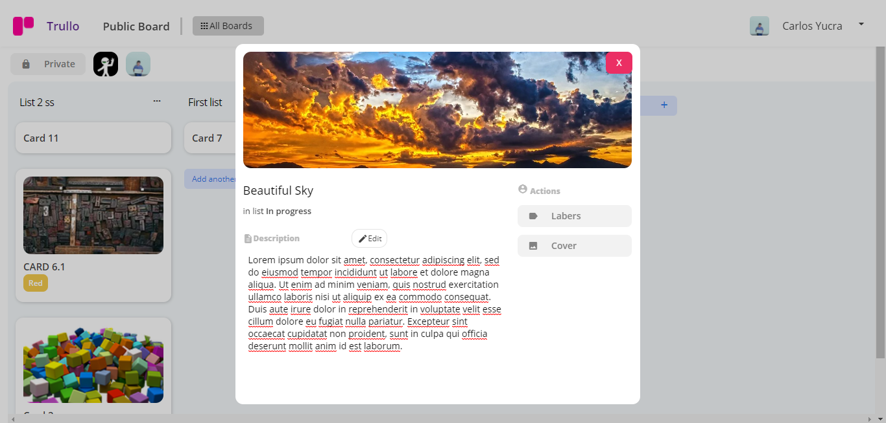
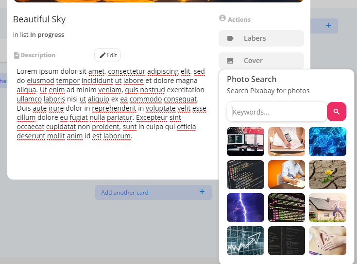

# Trello Clone

This project was developed with React.js, AWS thought Serverless (Node.js)

## Recourses

* Frontend with React.js: [Here](app/)
* Backend with Node.js (AWS-serverless): [Here](server/)

## ScreenShots

### Home

### Board Details

### Card Details

### Search photos (Pixabay)

